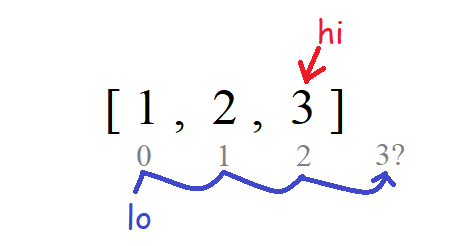

# Algorithms in Python: How to Implement Binary Search 

[<< Week 3: Misc #1](https://dev.to/erikhei/whiteboarding-in-python-check-if-a-string-is-a-permutation-of-a-palindrome-2a5g) | [View Solution on GitHub](https://github.com/erik-hei/whiteboarding-with-erik/blob/master/search-and-sort/binary_search.py)

*(Image Source: pixy.org)*

Happy Monday, everyone, today we're going to dive into our first algorithm.  I know, already, it might seem intimidating, but we'll take it step by step. I will be your binary search spirit guide. 

### Searching for an Element in a List

Let's imagine you have a list of numbers. You want to find if the number 17 is the list. The brute-force approach is to look at each number in the list and ask, "Is this it? Is *this* it? How about this?" The method would look something like this:

	def search(nums, value):
	  for i in range(len(nums)):
	    if nums[i] == value:
	      return i
	
	print(search([1, 10, 17, 4, 3], 17))
	
Running the above print statement would print 2, the index of 17 in the list. The time complexity of our solution is O(N), since for a list N numbers long, the for loop will run N times.

### Improving Time Complexity Using Binary Search

O(N) is okay as a time complexity, but let's think of a way to do better. No matter what, we'll always have to look, at most, at each element in the list. But what if they were sorted?

	>>> l = [1, 10, 17, 4, 3]
	>>> l.sort()
	>>> print(l)
	[1, 3, 4, 10, 17]
	
Python has a `.sort()` method that will sort the elements in the list. This takes its own time complexity, which we'll talk about in a future lesson. Now, if you were to look, with your human eyes, at the list, and were asked to find 17,  you would probably notice the pattern and have a better idea where to look. 

You might start by looking at the middle value, 4. You know that 17 is greater than four, and you've seen that the numbers are in order, so you might look to an item higher in the list. 

You look at the 10, and see it is still less than 17. You look to the right in the list again, and find the 17. You know this must be the only place 17 can go, since you know the list is sorted. Similarly, if you were looking for a number not in the list, such as 16, you would see it should go between the 10 and the 17. Then you would know 16 is not contained in the list, even though you haven't looked at every value. 

This strategy is how binary search operates. The search function picks a middle point, and knowning the list is sorted, moves to a new middle point to the left or right according to the value. 

Here is a more visual example from Wikipedia:

Looking for the value 7 in the above list, it starts by checking the middle value of 14, which is too high, then moves to 6, which is too low, then 8, and finally reaches the 7 at index 4. 

### Time Complexity of Binary Search

Brute force was O(N) time complexity, so what is the time complexity of our new approach? Best case is O(1), where the first number we find is the right value, but what about worst case? You'll notice we start by cutting the numbers we have to look at in half by picking a middle pointer, then we cut it in half again and again, for a total of 4 iterations. The total complexity is "the amount of times we can cut the list in half" in layman's terms. In math, this is represented as O(log N), where *log* is base 2. If you're unfamiliar with logarithms, don't worry, let me explain it another way. 

Look at the following expression: 

### 24 = 16

For the example above with a list of length 16, it took at most 4 iterations to reach the right value. So how can we rearrange the equation so the exponent 4 is on one side? The answer is we can express this in logarithmic form. 2 is the base, and 16 takes the place of N, the length of our list. Thus, the same expression can then be written as:

### log2(16) = 4

So for a list of length 16, binary search would take at most 4 iterations. In big O notation, we assume the logarithmic base is 2, which is why you see O(log N) instead of O(log2N). I know that just looking at O(log N), most people wouldn't be able to immediately visualize what that means. Just know that 4 is a lot less than 16, and likewise, O(log N) is much better time complexity than O(N). 

You'll see this on the following graph, where log2N is the dark blue line, and O(N) is the green line.

*(Image Source: Wikipedia)*

### Implementing Binary Search in Python

Now that we understand why we would want to use binary search, how would we implement it? We can break it down into these steps:

1. Starting with the full list, pick the value in the middle and compare it to the given value.
2. If the value is equal to the number in the middle, return its index.
3. Otherwise, narrow the list to either the upper or lower half depending on the middle or the upper value. 
4. Rinse and repeat with each new smaller list until either the value is found, or we run out of list to search. 

If the "rinse and repeat" sounds like recursion to you, you're right, we'll be using recursion in this implementation. For those of you who aren't familiar with recursion, we'll do more problems to explain it more in the future. But for now, all you have to know about recursion is that it happens when a function calls itself. 

So let's set up the method. Go ahead and open up a Repl.it in another tab to follow along if you haven't already. 

	def binary_search(nums, value):
		pass

Now, let me ask you a question. Let's say we have the middle index, `mid`. How are we going to keep track of the smaller segment of the list? We could perhaps use the totally sick list methods in python to make a smaller list, i.e. `[mid:]` and `[:mid]`, for the upper and lower halves, respectively. However, we want to return the index of where the value is in the list, and once we make a smaller list, it might not be at that index. 

For example, let's take finding the value 3 in the list `[1, 2, 3]`. We see that 3 is greater than the middle value, 2, so we make a smaller list containing `[2, 3]`. Now the 3 is at index 1, not index 2! It seems we might want to try something else.

Instead, we could just keep track of the indices that make up our smaller list, saved to the variables `lo` and `hi`. But wait! You might look at the method we defined above and notice it take in only two arguments, `nums` and `value`. How would we keep track of more arguments? 

What we'll do is define a helper method that takes in all the arguments that we need, and then the meat of our search function will live in there. We'll then call the helper method from within our original method. My helper method here is called `search2()`. 

	def search2(nums, value, lo, hi):
		pass
		
	def binary_search(nums, value):
		search2(nums, value, ??, ??)
		
No we just have to set up our call to search2. The low index to start is the beginning index, 0, and the high index is the end of the list, which would be the length minus one. Lastly, be sure that you're not just calling search2 but *returning* it, since we want to return the value that search2 is returning. 

	def binary_search(nums, value):
		lo = 0
		hi = len(nums) - 1
		return search2(nums, value, lo, hi)

You might say, are we technically cheating? What if the prompt says, "write a method to______" Write A method. And now we're kind of writing two. Well, don't worry. This is considered standard practice, and comes up a lot in recursive problems, especially. 

#### Defining the Recursive Method

What is our recursive method going to look like? Let's look at the steps we wrote earlier: 

1. Pick the value in the middle of the list and compare it to the given value.
2. If the value is equal to the number in the middle, return its index.
3. Otherwise, narrow the list to either the upper or lower half depending on the middle or the upper value. 
4. Rinse and repeat with each new smaller list until either the value is found, or we run out of list to search. 

As with #1, let's define our middle value. You might be tempted to set it as the high index divided by two, but thinking on future iterations, the low value might not be zero. So, we want the average between the two. Additionally, we'll use the integer division operator, `//` to make sure the `mid` value is an integer and therefore a valid index in the list. 

	def search2(nums, value, lo, hi):
		mid = (lo + hi) // 2
		
Next, we want to compare it to the given value. There are three possible outcomes:

1. The value at `mid` is greater than the given value.
2. The value at `mid` is less than the given value.
3. The two values are equal.

We'll transform this into an if/else statement, like so:
	
	if (nums[mid] < value): # look in upper half
		pass
	elif (nums[mid] > value): # look in lower half
		pass
	else: # if value == nums[mid]
		pass

Let's start with the first statement. How would we call the function on the upper half? The variables `nums` and `value` remain the same, but let's think about `lo` and `hi`. The new low index is the middle, and the high index remains the same. However, we already checked the middle, so we can move the middle index up by 1. 

	if (nums[mid] < value):
		return search2(nums, value, mid + 1, hi)
		
The next clause will be similar. To get the lower half of the list, the lower index stays the same, and `hi` changes to `mid`, although, again, since we already checked `mid`, we can move it down by subtracting 1. 

	elif (nums[mid] > value): # look in lower half
		return search2(nums, value, lo, mid - 1)
		
Finally, the remaining condition is that the value at `mid` is equal to the value that was passed. In this case, we can just return `mid`, because it is the index where that value can be found. 

	else:
		return mid
		
Now we have all our cases...except one. What if the value isn't in the list? Somewhere we have to return `None` (or -1, if you want to keep strict with types).

Let's pretend we're trying to find 4 in the list `[1, 2, 3]`. The first iteration would set `mid` at index 1, and since its value of 2 is less than 4, we would move up the list. `lo` is redefined as `mid + 1`, which is index 2. In the following iterations, `lo` keeps moving up and up until it surpasses `hi`:

The final value of `lo` is 3, and this index isn't even on the list! What's more is that it's greater than the `hi` index. We want to write a rule that will fit all conditions, such as `hi` moving down the list until it is less than `lo`. To achieve this, we simply add an `if` statement at the top of our function that returns `None` if the index `lo` is greater than `hi`.

	  if lo > hi:
	  	return None # not in list
	  	
And we're done! In total, the method looks like this:

*binary_search.py*

	def search2(nums, value, lo, hi):
	  if lo > hi:
	    return None # not in list
	  mid = (lo + hi) // 2
	  if (nums[mid] < value): # look in upper half
	    return search2(nums, value, mid + 1, hi)
	  elif (nums[mid] > value): # look in lower half
	    return search2(nums, value, lo, mid - 1)
	  else: # if value == nums[mid]
	    return mid
	
	def binary_search(nums, value):
	  lo = 0
	  hi = len(nums) - 1
	  return search2(nums, value, lo, hi)

If we print the return value of `binary_search([1,2,3], 1)`, we should get index 0, and if we try `binary_search([1,2,3], 4)`, we should see `None` because 4 is not in the list. Try a longer list and see how fast the method is!

### When to Use Binary Search

You're probably wondering, when am I going to use binary search? Do I always have to use it when searching for something in a list? It depends on the question.

If the prompt says the list is already sorted, then YES, you should probably use binary search, or some modification of it. A common interview question is, "Find a number in a sorted array that has been rotated N times."

What if you are asked to find something in a list that is not sorted? Then you have to account for the time complexity it takes to sort the list first. Assuming you use merge sort (which we'll cover later), the time complexity is O(N log N). This is greater than O(N), what it would take to simply look at each element in the array. If this is the case, that sorting the list would take the complexity from O(N) to O(N log N), then you're better off leaving your fancy algorithms alone and using a brute force approach instead.

That concludes Whiteboarding with Erik for this week. Thanks for reading, and if you still have questions, drop me a comment and I'll be happy to look into it. Or, if you have an interview question you'd like to see covered here, feel free to comment that as well. 

[<< Week 3: Misc #1](https://dev.to/erikhei/whiteboarding-in-python-check-if-a-string-is-a-permutation-of-a-palindrome-2a5g)

*Erik Heikkila is a Teaching Assistant at General Assembly Seattle. This blog is not associated with GA.*

