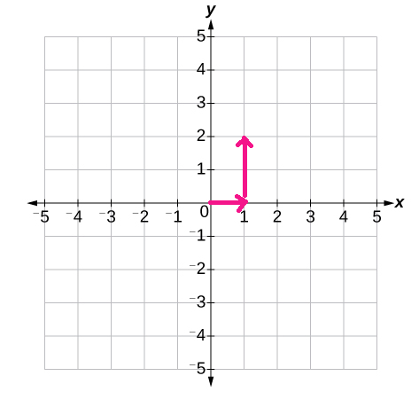
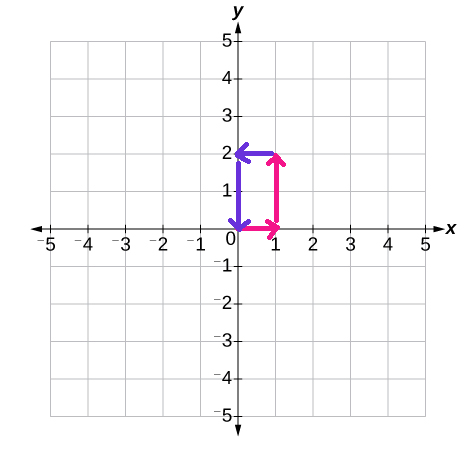

# DIY Robot Vacuum: Bring Him Home!

[<< Week 11: Merge Sort](https://dev.to/erikhei/merge-sort-when-you-re-too-much-of-a-nerd-to-use-sort-34ki) | [View Solution on Github](https://github.com/erik-hei/whiteboarding-with-erik/blob/master/robot_return_home.py)

<h1>Hello</h1>

*My ride is here. (Image: Catcheckup.com)*

I'm sure you remember when Roombas first came out, and they were all the rage. Where are they now? Is our humble explorer still roaming the endless carpet of a [McMansion bedroom ensuite](https://mcmansionhell.com/post/628714198070902784/the-mcmansion-hell-yearbook-1976) that it hasn't left since 2007? 

This sample interview question has to do with exactly that. Let's take a look.

	# Given a string representing the sequence of moves a 
	# robot vacuum makes, return whether or not it will 
	# return to its original position. 
	#
	# The string will only contain L, R, U, and D characters, 
	# representing left, right, up, and down respectively.

Does it sound complicated? Don't worry, we're going to break it down step by step.

Let's start with defining the method. It takes in one parameter, a string which we'll call `direction`. 

	def return_home(directions):
		pass

Next, you might have guessed it--some math is involved. Let's think back to primary school and the cartesian coordinate system. Our humble robot explorer starts at the origin and travels a few directions, say one foot right and two up. It would be at the position (1, 2). 

How would we move it back home? We would move it two feet down in the minus Y-direction and one left, in the minus X-direction. But it doesn't matter which of those actions we take first. As long as we move -1 X and -2 Y, our humble robot explorer will return to its home at (0, 0). 

So, we can keep track of the robot's X and Y coordinates, adding or subtracting 1 based on each direction we get, and if by the end of the `directions` string, we have an X and Y coordinate of (0, 0), the robot has returned home. Hooray!

The first thing we'll do is define those x and y coordinates. They both start at 0. 

	def return_home(directions):
	  x = 0
	  y = 0
	  
Next, we want to iterate over each letter in the string. A `for` loop should work. I'm calling each letter a `direction`. 

 	for direction in directions:
 	
Now, let's make a simple `if` statement for each one. We've established that "R" (right) is in the positive X-direction, and "L" (left) is the negative X-direction, so we'll add or subtract 1 to `x` accordingly.

	  for direction in directions:
	    if direction == "R":
	      x += 1
	    elif direction == "L":
	      x -= 1
	      
The Y-direction is fairly the same, we add 1 for "U" (up), and subtract 1 for "D" (down).

	  for direction in directions:
	    if direction == "R":
	      x += 1
	    elif direction == "L":
	      x -= 1
	    elif direction == "U":
	      y += 1
	    elif direction == "D":
	      y -= 1	
	      
Once we have looped through each direction in the string, we're ready to check if our robot has returned home. Simply return whether or not `x` and `y` are equal to zero. Be sure that this goes outside the `for` loop. Altogether:

	def return_home(directions):
	  x = 0
	  y = 0
	  for direction in directions:
	    if direction == "R":
	      x += 1
	    elif direction == "L":
	      x -= 1
	    elif direction == "U":
	      y += 1
	    elif direction == "D":
	      y -= 1
	  return x == 0 and y == 
	  
## Testing it out

Let's try the example from earlier, one right and two up. 

	print(return_home("RUU"))
	# -> False
	
But, if we go two down and one left, we should get `True`. 

	print(return_home("RUULDD")
	# -> True
	
You can try out an impressively long string of letters to see if the robot can make it back from the other side of the McMansion lawyer foyer.

	print(return_home("LRULLRRDDRUDLLLURRLRULLRRDDRUDLLLURR"))
	# -> True
	
That's it for this week, please follow the blog if you're interested in more Python practice. Also, I would like to hear from you! Let me know in the comments if there are any topics you'd like us to cover.

[<< Week 11: Merge Sort](https://dev.to/erikhei/merge-sort-when-you-re-too-much-of-a-nerd-to-use-sort-34ki) | [View Solution on Github](https://github.com/erik-hei/whiteboarding-with-erik/blob/master/robot_return_home.py)

*Erik Heikkila is a Teaching Assistant at General Assembly. This blog is not associated with GA.*